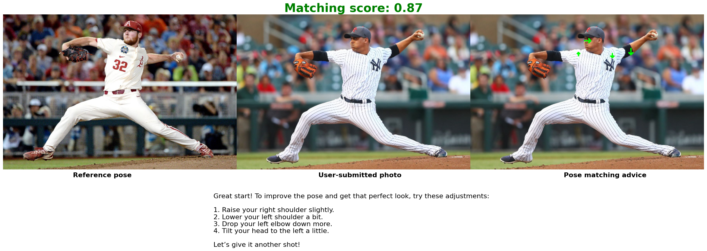

 # 📸 Photo Posing Assistant (In progress)

Photo Posing Assistant is a web application designed to help tourists take better photos at famous landmarks and attractions. It suggests popular poses based on location, provides posing guides, and offers feedback to improve your photography game.

## 🚀 **Features**

- 🌍 **Location-based Pose Suggestions**: 
Find the most liked and creative photo poses from fellow tourists at your current or selected attraction.

- 🧍‍♂️ **Pose Guidance**: 
 Step-by-step visual or textual instructions to help you replicate great poses.

- 🧠 **AI Photo Grading**:
Upload your photo to receive feedback and a grade based on pose accuracy, framing, and aesthetics.

- ❤️ **Pose Ratings and Favorites**:
    Vote for poses you love and save your favorites for future trips.

## 📸 Demo
**Pose Guidance and AI Photo Grading**

Reference pose : Reference pose from another tourist

User-submitted photo: Your uploaded photo

Pose matching advice: AI-generated advice to 
help you match the pose more accurately
## 📈 **Project Status**

- ✅ **Have Done**
    - AI Pose Guidance
    - AI Photo Grading
- 📝 **To Do**
    - Location-based Pose Suggestions
    - Backend
    - Frontend
    - Deploy to Azure
    - CI/CD pipeline
## 🛠️ **Tech Stack**

- AI/ML: Pytorch (OpenCV, PoseNet, OpenAI)
- Deployment: Kubernetes, Docker, Jenkins
- Frontend: React
- Backend: FastAPI
- Database: MongoDB
- APIs: Cloudinary (for photo storage)

## 📦 **Installation**

    git clone https://github.com/your-username/photo-posing-assistant.git
    cd photo-posing-assistant
    npm install
    npm start

