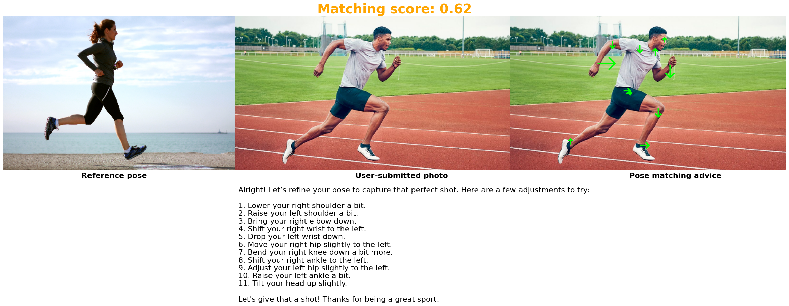

 # 📸 Photo Posing Assistant (In progress)

Photo Posing Assistant is a web application designed to help tourists take better photos at famous landmarks and attractions. It suggests popular poses based on location, provides posing guides, and offers feedback to improve your photography game.

## 🚀 **Features**

- 🧠 **Pose Searching**:
Search for poses by entering keywords about the location, your outfit, or desired style, uploading a landscape photo of your chosen location, or using both.
- 🧍‍♂️ **Pose Guidance**: 
Step-by-step visual or textual instructions to help you replicate great poses.

## 📸 Demo
**Pose Guidance and AI Photo Grading**

Reference pose : Reference pose from another tourist

User-submitted photo: Your uploaded photo

Pose matching advice: AI-generated advice to 
help you match the pose more accurately
## 📈 **Project Status**

- ✅ **Have Done**
    - AI Pose Guidance
    - AI Photo Grading
- 📝 **To Do**
    - Location-based Pose Suggestions
    - Backend
    - Frontend
    - Deploy to Azure
    - CI/CD pipeline
## 🛠️ **Tech Stack**

- AI/ML: Pytorch (OpenCV, PoseNet, OpenAI)
- Deployment: Kubernetes, Docker, Jenkins
- Frontend: React
- Backend: FastAPI
- Database: MongoDB
- APIs: Cloudinary (for photo storage)

## 📦 **Installation**

    git clone https://github.com/your-username/photo-posing-assistant.git
    cd photo-posing-assistant
    npm install
    npm start

